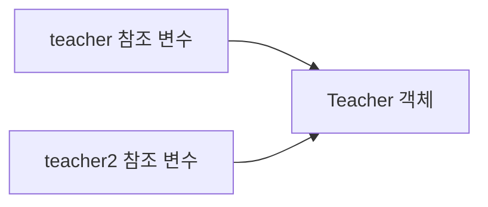
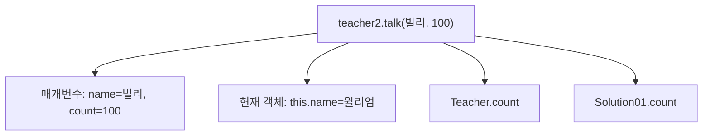
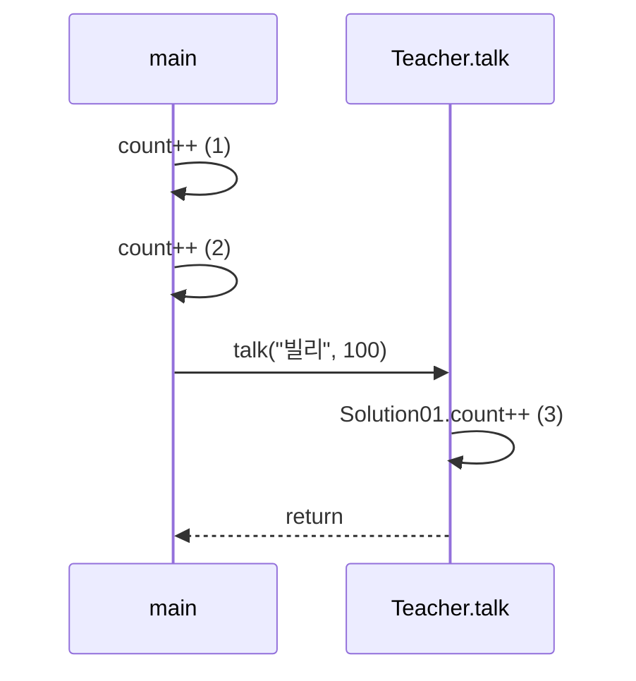

# Solution01로 이해하는 Java 기초

이 문서는 [`Solution01.java`](./Solution01.java)에 나온 내용만 간단히 정리한다.

## 1. 클래스와 객체

- `Solution01`, `Teacher`는 클래스다.
- `new Teacher()`는 `Teacher` 객체를 생성한다.
- `teacher`는 객체 자체가 아니라 객체를 가리키는 **참조 변수**다.
- 한 파일에는 파일명과 같은 `public` 클래스가 하나만 존재할 수 있다. 따라서 `Solution01.java`의 공개 클래스는 `Solution01`이다.



`Teacher teacher2 = teacher;`는 객체를 복사하지 않는다. 두 변수가 같은 객체를 참조하므로 `teacher2.name = "윌리엄"` 이후 `teacher.name`도 `"윌리엄"`이다.

## 2. `null`과 객체 생성

```java
Teacher teacher;
teacher =null;
teacher =new

Teacher();
```

| 코드                         | 의미                |
|----------------------------|-------------------|
| `Teacher teacher;`         | 지역 참조 변수 선언       |
| `teacher = null;`          | 가리키는 객체가 없는 상태    |
| `teacher = new Teacher();` | 객체를 생성하고 그 참조를 저장 |

`null`을 대입하는 것만으로는 예외가 발생하지 않는다. `null`인 참조로 필드나 메서드에 접근하면 `NullPointerException`이 발생한다.

## 3. 필드의 기본값

`new Teacher()`로 객체를 만들면 명시적으로 초기화하지 않은 인스턴스 필드에 기본값이 들어간다.

| 필드 타입     | 이 코드에서 확인하는 기본값 |
|-----------|----------------:|
| `int`     |             `0` |
| `double`  |           `0.0` |
| `char`    |        `\u0000` |
| `boolean` |         `false` |
| `String`  |          `null` |

필드와 달리 지역변수는 자동으로 기본값이 주어지지 않으므로 사용 전에 초기화해야 한다.

## 4. 지역변수, 인스턴스 필드, `static` 필드

| 구분          | 코드 예시                               | 소속              |
|-------------|-------------------------------------|-----------------|
| 지역변수/매개변수   | `teacher`, `name`, `count`          | 실행 중인 메서드 또는 블록 |
| 인스턴스 필드     | `this.name`, `age`                  | 각 `Teacher` 객체  |
| `static` 필드 | `Teacher.count`, `Solution01.count` | 클래스             |

`talk(String name, int count)` 안에서는 매개변수 이름이 필드 이름과 같다. `name`은 매개변수이고 `this.name`은 현재 객체의 필드다.



## 5. 블록 스코프와 실행 결과

`teacher2`는 중괄호 블록 안에서 선언되었기 때문에 블록 밖에서는 사용할 수 없다.

`Solution01.count`는 `main`에서 두 번, `talk`에서 한 번 증가하므로 마지막 값은 `3`이다.



## 면접·실무 핵심 정리

| 질문                             | 짧은 답변                                     |
|--------------------------------|-------------------------------------------|
| `teacher2 = teacher`는 깊은 복사인가? | 아니다. 같은 객체의 참조값을 대입한 것이다.                 |
| `null` 대입 시 바로 예외가 발생하는가?      | 아니다. `null`을 역참조할 때 발생한다.                 |
| `this.name`에서 `this`는 무엇인가?    | 현재 메서드를 호출한 객체를 가리킨다.                     |
| 인스턴스 필드와 `static` 필드의 차이는?     | 인스턴스 필드는 객체별로, `static` 필드는 클래스 단위로 존재한다. |
| 지역변수의 범위는?                     | 선언된 블록 내부로 제한된다.                          |

> 메모리를 “지역변수는 스택, 객체는 힙, `static`은 메서드 영역”으로 설명하는 것은 학습용 JVM 모델이다. 면접에서는 JVM 구현과 최적화에 따라 실제 저장 방식이 달라질 수 있다고 덧붙이면 정확하다.