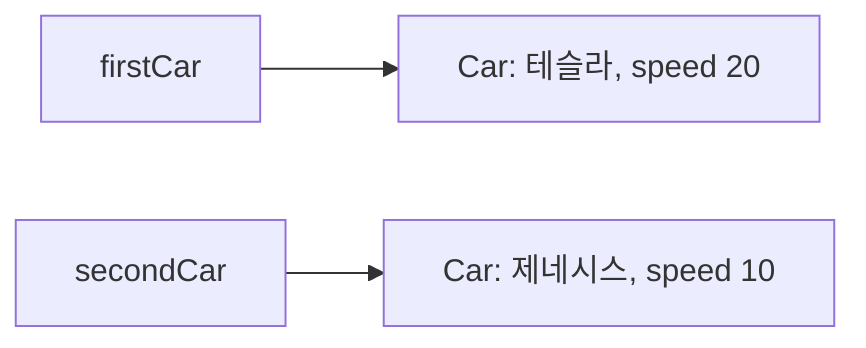
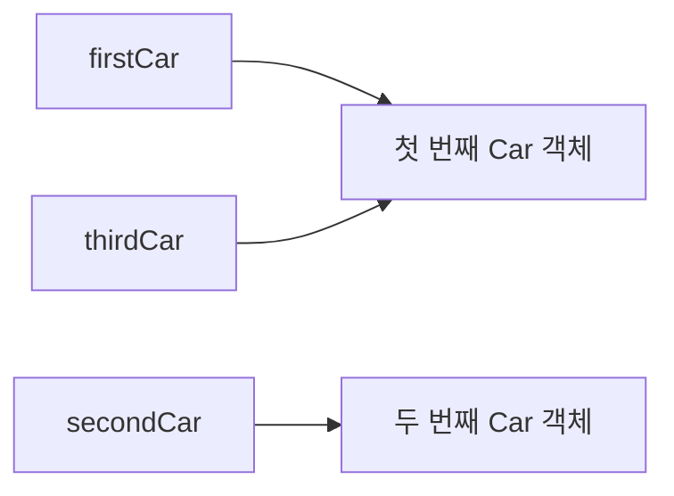

# Solution02로 이해하는 객체와 인스턴스

이 문서는 [`Solution02.java`](./Solution02.java)에 나온 내용만 간단히 정리한다.

## 1. 객체마다 구분되는 필드

`new Car()`를 두 번 호출하면 서로 다른 `Car` 인스턴스가 생성된다.

| 참조 변수       | `model` | `accelerate()` 호출 횟수 | 마지막 `speed` |
|-------------|---------|---------------------:|------------:|
| `firstCar`  | 테슬라     |                    2 |          20 |
| `secondCar` | 제네시스    |                    1 |          10 |



`model`과 `speed`는 인스턴스 필드이므로 각 객체가 별도의 값을 가진다.

## 2. 인스턴스 메서드

```java
void accelerate() {
    speed += 10;
}
```

`firstCar.accelerate()`는 `firstCar`가 참조하는 객체의 `speed`만 변경한다. 인스턴스 메서드는 호출 대상 객체의 상태를 읽거나 변경할 수 있다.

## 3. 참조값 비교와 공유

| 표현식                       | 결과      | 이유            |
|---------------------------|---------|---------------|
| `firstCar == secondCar`   | `false` | 서로 다른 객체를 참조  |
| `Car thirdCar = firstCar` | 참조 대입   | 객체를 새로 만들지 않음 |
| `firstCar == thirdCar`    | `true`  | 같은 객체를 참조     |



## 면접·실무 핵심 정리

| 질문                              | 짧은 답변                              |
|---------------------------------|------------------------------------|
| 클래스와 인스턴스의 차이는?                 | 클래스는 설계이고 인스턴스는 `new`로 생성된 실제 객체다. |
| 참조 타입에서 `==`는 무엇을 비교하는가?        | 두 변수가 같은 객체를 참조하는지 비교한다.           |
| `thirdCar = firstCar`는 객체 복사인가? | 아니다. 같은 참조값을 대입한다.                 |