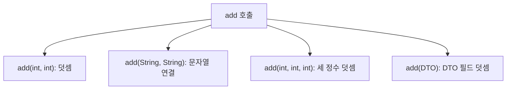
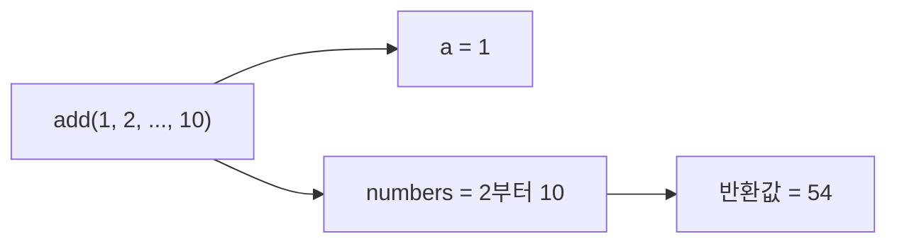

# Solution03으로 이해하는 메서드

이 문서는 [`Solution03.java`](./Solution03.java)에 나온 내용만 간단히 정리한다.

## 1. 매개변수와 반환 타입

| 메서드                       | 매개변수     | 반환 타입    |
|---------------------------|----------|----------|
| `print(String message)`   | 문자열 1개   | `void`   |
| `add(int a, int b)`       | 정수 2개    | `int`    |
| `add(String a, String b)` | 문자열 2개   | `String` |
| `add(DTO dto)`            | `DTO` 1개 | `int`    |

`void`는 반환값이 없다는 뜻이다. `int`나 `String`을 반환 타입으로 선언하면 해당 타입의 값을 `return`해야 한다.

## 2. 메서드 오버로딩

오버로딩은 같은 이름의 메서드를 서로 다른 매개변수 목록으로 선언하는 것이다.



| 오버로딩 구분에 사용     | 사용하지 않음        |
|-----------------|----------------|
| 매개변수 타입, 개수, 순서 | 반환 타입, 매개변수 이름 |

따라서 `add(int a, int b)`와 `add(int c, int d)`는 같은 시그니처라서 함께 선언할 수 없다.

## 3. 가변인자

```java
int add(int a, int... numbers)
```

`int... numbers`는 호출 시 여러 정수를 받고 메서드 내부에서는 배열처럼 사용한다. 가변인자는 매개변수 목록의 마지막에 위치해야 한다.



이 코드의 가변인자 메서드는 `numbers`만 합산하므로 첫 번째 인수 `a`는 결과에 포함되지 않는다.

## 면접·실무 핵심 정리

| 질문                   | 짧은 답변                      |
|----------------------|----------------------------|
| 오버로딩은 언제 결정되는가?      | 컴파일 시 인수의 타입과 개수에 맞춰 결정된다. |
| 반환 타입만 바꾸면 오버로딩되는가?  | 아니다. 매개변수 목록이 달라야 한다.      |
| 가변인자는 내부에서 어떻게 다루는가? | 배열처럼 다룬다.                  |