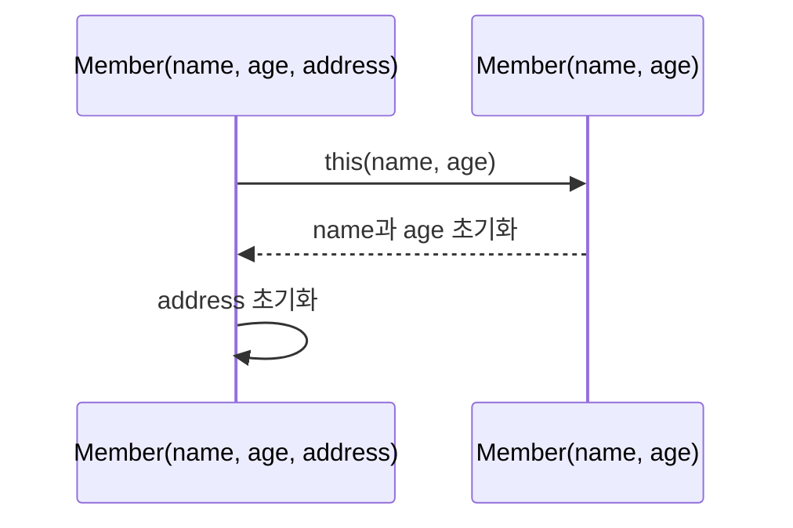

# Solution04로 이해하는 생성자

이 문서는 [`Solution04.java`](./Solution04.java)에 나온 내용만 간단히 정리한다.

## 1. 생성자와 필드 초기화

생성자는 객체를 만들 때 실행되며 클래스 이름과 같고 반환 타입을 적지 않는다.

| 생성 코드                  | 선택되는 생성자              | 결과                      |
|------------------------|-----------------------|-------------------------|
| `new Member()`         | `Member()`            | `name="기본값"`, `age=100` |
| `new Member("원이", 20)` | `Member(String, int)` | 전달받은 값으로 변경             |

```mermaid
flowchart LR
    create["new Member()"] --> field["필드 초기값 적용"]
    field --> constructor["Member() 실행"]
    constructor --> object["Member 객체 완성"]
```

생성자를 하나도 선언하지 않은 경우에만 컴파일러가 기본 생성자를 제공한다. 이 코드에는 생성자를 직접 선언했으므로 `Member()`도 직접 작성해야 호출할 수 있다.

## 2. `this`와 생성자 오버로딩

```java
Member(String name, int age) {
    this.name = name;
    this.age = age;
}
```

`this.name`은 현재 객체의 필드이고 `name`은 생성자의 매개변수다. 생성자도 매개변수 목록이 다르면 오버로딩할 수 있다.

## 3. 생성자 체이닝

```java
Member(String name, int age, String address) {
    this(name, age);
    this.address = address;
}
```



`this(...)`는 같은 클래스의 다른 생성자를 호출하며 생성자 본문의 첫 문장이어야 한다.

## 면접·실무 핵심 정리

| 질문                       | 짧은 답변                         |
|--------------------------|-------------------------------|
| 기본 생성자는 항상 자동 생성되는가?     | 생성자를 하나도 선언하지 않았을 때만 자동 생성된다. |
| `this.name = name`의 의미는? | 매개변수 값을 현재 객체의 필드에 대입한다.      |
| 생성자 체이닝의 장점은?            | 공통 초기화 코드의 중복을 줄인다.           |