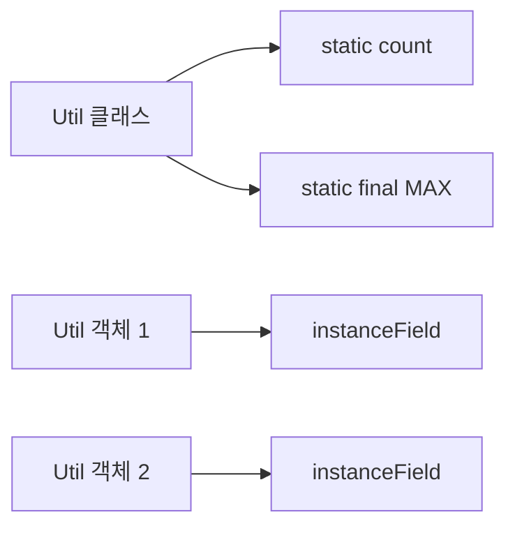
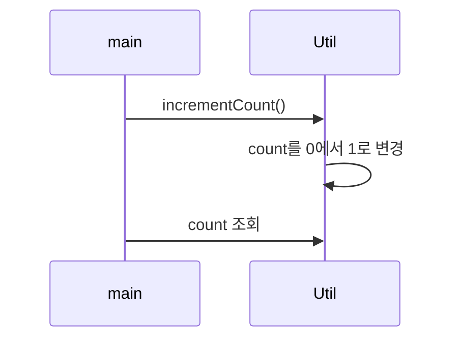

# Solution05로 이해하는 static

이 문서는 [`Solution05.java`](./Solution05.java)에 나온 내용만 간단히 정리한다.

## 1. 클래스 멤버와 인스턴스 멤버

| 구분           | 코드 예시                    | 접근 방법               |
|--------------|--------------------------|---------------------|
| `static` 필드  | `Util.count`, `Util.MAX` | 클래스 이름으로 접근         |
| `static` 메서드 | `Util.incrementCount()`  | 객체 생성 없이 호출         |
| 인스턴스 필드      | `instanceField`          | `Util` 객체를 생성한 뒤 접근 |



`static` 멤버는 특정 객체가 아니라 클래스에 속한다. 따라서 `new Util()` 없이 `Util.incrementCount()`를 호출할 수 있다.

## 2. `static` 메서드의 접근 범위

`incrementCount()`는 같은 클래스의 `static count`를 직접 변경한다. 반면 특정 객체가 없는 정적 메서드에서는 `this`나 `instanceField`를 직접 사용할 수 없다.



## 3. `final static` 상수

```java
final static int MAX = 10;
```

`static`은 클래스에 속한다는 뜻이고 `final`은 한 번 대입한 값을 다시 바꿀 수 없다는 뜻이다. 상수 이름은 관례상 대문자와 밑줄을 사용한다.

## 면접·실무 핵심 정리

| 질문                        | 짧은 답변                      |
|---------------------------|----------------------------|
| `static` 필드는 객체마다 생성되는가?  | 아니다. 클래스 단위로 하나의 값을 공유한다.  |
| 정적 메서드에서 `this`를 쓸 수 있는가? | 없다. 정적 메서드에는 호출 대상 객체가 없다. |
| `static final`은 무엇에 쓰는가?  | 클래스 공통 상수를 선언할 때 사용한다.     |