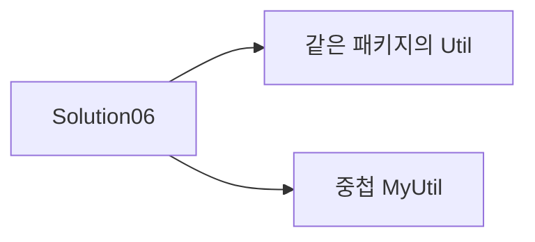
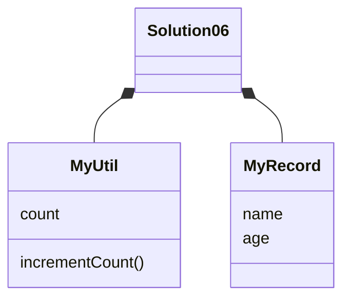

# Solution06으로 이해하는 중첩 타입

이 문서는 [`Solution06.java`](./Solution06.java)에 나온 내용만 간단히 정리한다.

## 1. 같은 패키지의 클래스 접근

`Solution06`은 `Solution05.java`에 선언된 `Util`을 사용한다. 두 클래스가 같은 기본 패키지에 있고 `Util`이 패키지 접근 범위를 가지므로 접근할 수 있다.



실무에서는 이름 충돌을 피하고 코드를 구조화하기 위해 명시적인 패키지를 사용한다.

## 2. 정적 중첩 클래스

```java
public static class MyUtil {
    static int count = 0;
}
```

| 표현                        | 의미                      |
|---------------------------|-------------------------|
| `Solution06.MyUtil`       | 바깥 클래스 이름을 통한 중첩 클래스 접근 |
| `MyUtil.incrementCount()` | 중첩 클래스의 정적 메서드 호출       |
| `MyUtil.count`            | 중첩 클래스에 속한 정적 필드        |

정적 중첩 클래스는 바깥 클래스의 인스턴스 없이 사용할 수 있다.

## 3. 중첩 record

```java
public static record MyRecord(String name, int age) {
}
```

`MyRecord`는 `name`과 `age`를 구성 요소로 갖는 레코드다. 레코드는 데이터를 간결하게 표현하는 클래스 형태이며, 이 코드에서는 선언만 하고 객체를 생성하지 않는다.



## 면접·실무 핵심 정리

| 질문                       | 짧은 답변                            |
|--------------------------|----------------------------------|
| 정적 중첩 클래스는 바깥 객체가 필요한가?  | 아니다. 바깥 클래스의 인스턴스 없이 사용한다.       |
| 패키지 접근 클래스는 어디서 접근 가능한가? | 같은 패키지 안에서 접근 가능하다.              |
| 레코드는 이 코드에서 왜 중첩했는가?     | `Solution06`에 소속된 데이터 타입임을 표현한다. |