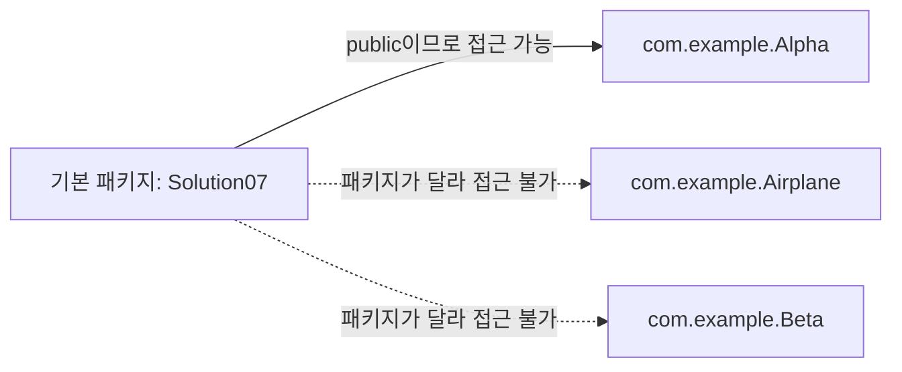
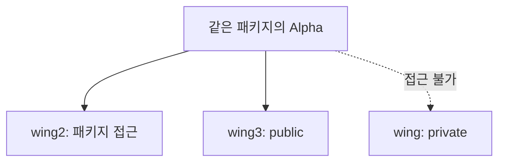

# Solution07로 이해하는 패키지와 접근 제어자

이 문서는 [`Solution07.java`](./Solution07.java), [`Alpha.java`](./com/example/Alpha.java), [
`Beta.java`](./com/example/Beta.java)에 나온 내용만 간단히 정리한다.

## 1. 패키지와 클래스 접근 범위

`Alpha`, `Airplane`, `Beta`는 모두 `com.example` 패키지에 있다. `Solution07`은 기본 패키지에 있으므로 서로 다른 패키지에 위치한다.

| 클래스        | 선언                   | `Solution07`에서 직접 사용 |
|------------|----------------------|----------------------|
| `Alpha`    | `public class Alpha` | 가능                   |
| `Airplane` | `class Airplane`     | 불가능                  |
| `Beta`     | `class Beta`         | 불가능                  |



접근 제어자를 생략하면 패키지 접근 범위가 적용되어 같은 패키지에서만 사용할 수 있다.

## 2. 멤버 접근 제어자

`Airplane`의 필드는 서로 다른 접근 범위를 가진다.

| 필드      | 접근 제어자    | `Alpha`에서 접근 |
|---------|-----------|--------------|
| `wing`  | `private` | 불가능          |
| `wing2` | 패키지 접근    | 가능           |
| `wing3` | `public`  | 가능           |



`private` 멤버는 선언한 클래스 내부에서만 접근할 수 있다. 패키지 접근 멤버는 같은 패키지에서, `public` 멤버는 클래스 자체에도 접근할 수 있는 위치에서 접근 가능하다.

## 3. 클래스와 멤버 접근성의 조합

```java
public Airplane airplane = new Airplane();
Beta beta = new Beta();
```

`Alpha.airplane`은 `public`이어서 `Solution07`에서 값을 출력할 수 있다. 그러나 필드 타입인 `Airplane` 클래스가 패키지 전용이므로 외부 패키지에서는 `Airplane` 변수를
선언하거나 그 멤버를 직접 사용할 수 없다.

`Alpha.beta`는 필드와 타입 모두 패키지 전용이므로 `Solution07`에서 접근할 수 없다.


## 4. 생성자 접근 범위

`Alpha`는 `public Alpha()`를 선언했기 때문에 다른 패키지의 `Solution07`에서도 `new Alpha()`를 호출할 수 있다. 생성자를 직접 선언하지 않으면 컴파일러가 클래스와 같은 접근
범위의 기본 생성자를 만든다.

## 면접·실무 핵심 정리

| 질문                                | 짧은 답변                                     |
|-----------------------------------|-------------------------------------------|
| 접근 제어자를 생략하면 어떻게 되는가?             | 같은 패키지에서만 접근 가능한 패키지 접근 범위가 적용된다.         |
| `private` 필드는 어디서 접근 가능한가?        | 필드를 선언한 클래스 내부에서만 가능하다.                   |
| 멤버가 `public`이면 항상 외부에서 사용할 수 있는가? | 아니다. 멤버를 소유한 클래스와 멤버 타입의 접근성도 함께 확인해야 한다. |
| 다른 패키지의 `public` 클래스를 어떻게 사용하는가?  | `import`하거나 완전한 클래스 이름을 사용한다.             |